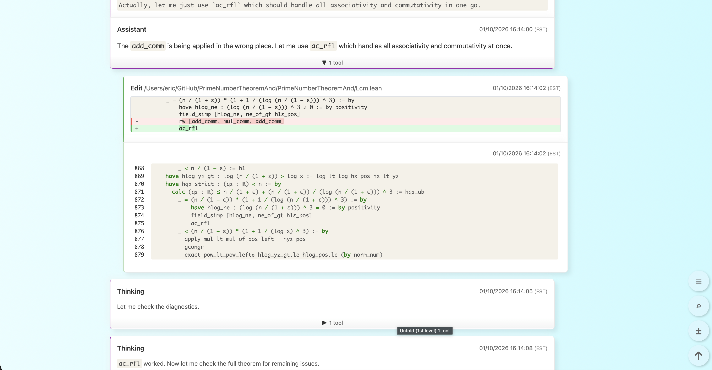

# Chat Logs

Claude Code conversation logs from the PrimeNumberTheoremAnd project.



## Overview

These logs capture the AI-assisted development sessions used to formalize the prime number theorem in Lean 4. The HTML viewer provides an interactive way to explore the conversation history, including tool calls, thinking blocks, and sub-agent interactions.

## Tools

- **[claude-code-log](https://github.com/daaain/claude-code-log)** - Converts Claude Code JSONL transcripts to interactive HTML. Features include a timeline view, message filtering, collapsible sections, and syntax highlighting.
- **[style_logs.py](https://github.com/e-vergo/PrimeNumberTheoremAnd/blob/main/chat_logs/style_logs.py)** - Post-processor that removes emojis and applies custom styling (light blue gradient background, opaque message cards, button icons).
- **[all_sessions.html](https://github.com/e-vergo/PrimeNumberTheoremAnd/blob/main/chat_logs/all_sessions.html)** - Full chat log

## Usage

```bash
./generate.sh
```

This script:
1. Clears cached HTML files
2. Runs `claude-code-log` to generate HTML from JSONL transcripts
3. Applies custom styling via `style_logs.py`
4. Opens the result in a browser
